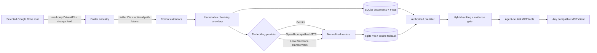

# gdrive-rag-mcp

[](https://github.com/phamviet86/gdrive-rag-mcp/actions/workflows/ci.yml)
[](LICENSE)

A local-first, scope-aware Google Drive hybrid index exposed through the Model Context Protocol
(MCP). Choose an embedding provider and model that fit your languages, privacy boundary, and
infrastructure; then query one durable index from multiple Hermes profiles or other MCP clients
without granting every caller access to every document.

Google Drive/Workspace remains the read-only source of truth. The service stores extracted chunks,
normalized embeddings, metadata, checksums, sync state, and index data—not downloaded source files.
It requires no LlamaCloud and uses LlamaIndex only at the replaceable chunking boundary.

> **Important:** retrieval assists research; it is not legal, tax, financial, economic, or business
> advice. Agents and people must inspect the linked source, effective date, jurisdiction, and later
> amendments. If `evidence.sufficient` is false, abstain instead of filling gaps.

## What the MVP does

- Recursively reads one configured Drive folder or Shared Drive scope with the read-only API.
- Stores every ancestor folder ID so any folder can be used as a recursive search boundary.
- Derives optional `owner_profile_id`, `business_function`, and PARA labels for display only.
- Authenticates the caller before tool execution and filters both FTS5 and vector candidates before
  ranking. A profile cannot widen its scope with tool arguments.
- Extracts Google Docs, Google Sheets, text/Markdown, text-based PDFs, and DOCX.
- Supports Gemini, any verified OpenAI-compatible `/embeddings` endpoint, and optional local
  Sentence Transformers behind one embedding protocol.
- Combines Unicode-safe SQLite FTS5 keyword search with sqlite-vec cosine search. A tested Python
  cosine fallback is used when the extension cannot load.
- Uses the Drive Changes API after an initial full scan, removes deleted/out-of-scope files, and
  periodically supports a complete reconciliation for moves and manually added content.
- Prevents vectors from different providers, models, endpoints, or dimensions from sharing an
  index by recording and validating an embedding fingerprint.
- Returns citations, source modified/indexed times, and a conservative evidence decision.
- Exposes the same read-only tools over profile-scoped stdio and bearer-protected Streamable HTTP.

## Architecture



Google, embedding-provider, and local-model credentials/resources stay with the service operator.
Remote clients receive only an MCP URL and a profile-specific bearer token.

## Embedding providers

Language coverage is a property of the selected model, not an indexing “language mode.” FTS5 uses
SQLite's Unicode tokenizer, while semantic quality depends on the model and domain. Evaluate your
actual languages and documents; this project does not claim perfect support for every language.

| Provider | Execution/privacy | Multilingual suitability | Extra install | Notes |
|---|---|---|---|---|
| `gemini` (default) | Hosted; chunks and queries go to Google's embedding API | Model-dependent; the default is designed for multilingual retrieval | None | Backward-compatible provider/model/dimension defaults |
| `openai-compatible` | Hosted or self-hosted; data goes to the configured base URL | Model-dependent | None | Implements the documented `POST /embeddings` JSON contract; API key may be optional for a trusted local endpoint |
| `sentence-transformers` | Local process/device after model download | Choose and evaluate a multilingual retrieval model | `pip install 'gdrive-rag-mcp[sentence-transformers]'` | Heavy PyTorch/model dependencies stay out of the base install |

Changing the embedding provider, model, endpoint, or dimensions requires rebuilding that vector
index. Changing MCP clients or agents does **not** require reindexing.

The HTTP adapter follows the [official OpenAI embeddings request/response schema](https://platform.openai.com/docs/api-reference/embeddings/create),
including batched string input, ordered results, optional dimensions, and float vectors. A dedicated
Ollama adapter is not claimed. If a particular Ollama deployment explicitly implements that
`/v1/embeddings` contract, test it as an OpenAI-compatible endpoint and set
`GDRIVE_RAG_EMBED_SEND_DIMENSIONS=false` if that deployment does not accept the dimensions field.

Gemini uses retrieval-specific query/document tasks and explicit output dimensions described in
the [official Gemini embedding documentation](https://ai.google.dev/gemini-api/docs/embeddings).
The local adapter uses the documented Sentence Transformers
[`encode_query` and `encode_document`](https://www.sbert.net/docs/package_reference/sentence_transformer/model.html)
methods with normalized output.

## Install

```bash
git clone https://github.com/phamviet86/gdrive-rag-mcp.git
cd gdrive-rag-mcp
python3.12 -m venv .venv
. .venv/bin/activate
pip install -e .
cp .env.example .env
```

For the local provider, install `pip install -e '.[sentence-transformers]'` instead. The project does
not automatically parse `.env`; load it with your shell or process manager. For example,
`set -a; . ./.env; set +a` in a trusted interactive shell. Never commit `.env`.

## Configure an embedding provider

Secret values come from the environment variable named by
`GDRIVE_RAG_EMBED_API_KEY_ENV`. The variable name is configuration; the secret value is never
stored in the index fingerprint or sample files.

### Gemini (backward-compatible default)

Existing environment configuration remains valid: if provider settings are absent, the service
uses Gemini, `gemini-embedding-001`, 768 dimensions, and `GEMINI_API_KEY`.

```bash
export GDRIVE_RAG_EMBED_PROVIDER=gemini
export GDRIVE_RAG_EMBED_MODEL=gemini-embedding-001
export GDRIVE_RAG_EMBED_DIMENSIONS=768
export GDRIVE_RAG_EMBED_API_KEY_ENV=GEMINI_API_KEY
export GEMINI_API_KEY=your_runtime_secret
```

### OpenAI-compatible endpoint

```bash
export GDRIVE_RAG_EMBED_PROVIDER=openai-compatible
export GDRIVE_RAG_EMBED_MODEL=text-embedding-3-small
export GDRIVE_RAG_EMBED_DIMENSIONS=1536
export GDRIVE_RAG_EMBED_BASE_URL=https://api.openai.com/v1
export GDRIVE_RAG_EMBED_API_KEY_ENV=OPENAI_API_KEY
export OPENAI_API_KEY=your_runtime_secret
```

For another compatible endpoint, replace the base URL, model, dimensions, and key variable. Never
put credentials in the base URL. Set `GDRIVE_RAG_EMBED_SEND_DIMENSIONS=false` only when the verified
endpoint/model does not accept that optional field; the configured output dimension is still
validated on every response.

OpenRouter exposes the same `/embeddings` contract. This example uses Qwen3 Embedding 8B at its
full 4096 dimensions and sends distinct query/document input types:

```bash
export GDRIVE_RAG_EMBED_PROVIDER=openai-compatible
export GDRIVE_RAG_EMBED_MODEL=qwen/qwen3-embedding-8b
export GDRIVE_RAG_EMBED_DIMENSIONS=4096
export GDRIVE_RAG_EMBED_BASE_URL=https://openrouter.ai/api/v1
export GDRIVE_RAG_EMBED_API_KEY_ENV=OPENROUTER_API_KEY
export OPENROUTER_API_KEY=your_runtime_secret
export GDRIVE_RAG_EMBED_QUERY_INPUT_TYPE=search_query
export GDRIVE_RAG_EMBED_DOCUMENT_INPUT_TYPE=search_document
```

Free OpenRouter endpoints may log or retain inputs. Do not send confidential Drive content to a
free endpoint unless its current data policy has been reviewed and explicitly accepted. Use a
suitable paid route with data collection denied or a local Sentence Transformers model when the
corpus must remain private.

### Local Sentence Transformers

```bash
pip install -e '.[sentence-transformers]'
export GDRIVE_RAG_EMBED_PROVIDER=sentence-transformers
export GDRIVE_RAG_EMBED_MODEL=sentence-transformers/paraphrase-multilingual-MiniLM-L12-v2
export GDRIVE_RAG_EMBED_DIMENSIONS=384
export GDRIVE_RAG_EMBED_DEVICE=cpu  # or a device supported by your local installation
```

The model name above is an example, not a universal recommendation. Model download/cache behavior,
licenses, language coverage, memory use, and hardware requirements belong to the selected model.

Common tuning:

```bash
export GDRIVE_RAG_EMBED_BATCH_SIZE=32
export GDRIVE_RAG_EMBED_TIMEOUT_SECONDS=60
```

All providers return normalized vectors and must return exactly the configured dimensions.

## Google authentication

Enable the Google Drive API, then choose one method.

### Service account (recommended for least privilege)

1. Create a service account and keep its JSON key in an operator-only secrets directory.
2. Share only the selected Drive folder with its email as **Viewer**. This creates a stronger folder
   boundary than a user OAuth token.
3. Set `GOOGLE_SERVICE_ACCOUNT_FILE` and `GDRIVE_FOLDER_ID`. For a Shared Drive, add the account
   with the minimum read role and set `GDRIVE_SHARED_DRIVE_ID`.

Do not enable domain-wide delegation unless separately reviewed. The code requests only
`https://www.googleapis.com/auth/drive.readonly`.

### User OAuth

1. Create an OAuth Desktop app client and keep its JSON outside the repository.
2. Set `GOOGLE_OAUTH_CLIENT_FILE` and `GOOGLE_OAUTH_TOKEN_FILE`.
3. Run `gdrive-rag-mcp auth-google` once and approve read-only access.

The Drive API has no OAuth scope meaning “read only this existing folder.” The OAuth token can read
files the user can read; the indexer enforces the configured folder during traversal. See Google's
[Drive authorization guide](https://developers.google.com/workspace/drive/api/guides/api-specific-auth).

## Drive folder scopes

`GDRIVE_FOLDER_ID` is the root indexed by the worker. The folder layout is an organizational
choice, not an authorization schema. A profile/business/PARA structure remains useful, for example:

```text
<configured-root>/
└── <owner-profile-id>/
    └── <business-function>/
        ├── projects/
        ├── areas/
        ├── resources/
        └── archives/
```

Every supported file below the configured root is indexed regardless of depth. The index records
the configured root ID and every descendant folder ID in that file's ancestry. Therefore one
`scope_folder_id` always means “this folder and all descendants”:

- a profile-owner folder ID searches the entire profile tree;
- a business-function folder ID searches that function and every nested PARA folder;
- any deeper folder ID narrows the same operation to that subtree.

Two-digit prefixes and the first three path levels may still produce owner/function/PARA labels in
results, but those names never grant access and are not required.

Each stdio process has one immutable caller identity:

```bash
export GDRIVE_RAG_PROFILE_ID=finance
export GDRIVE_RAG_ALLOWED_FOLDER_IDS=finance_profile_folder_id,shared_finance_folder_id
```

Each allowed ID grants only that folder and its descendants. The caller must also pass a
`scope_folder_id` on every search. SQL applies both boundaries before FTS5 or vector ranking, so a
folder outside the token's granted roots returns no documents.

For HTTP with multiple profiles, copy `access-policy.example.json` to an operator-only location.
The policy contains token environment-variable names, never token values:

```bash
cp access-policy.example.json ./secrets/access-policy.json
export GDRIVE_RAG_ACCESS_POLICY_FILE=./secrets/access-policy.json
export GDRIVE_RAG_TOKEN_ORCHESTRATOR="$(openssl rand -hex 32)"
export GDRIVE_RAG_TOKEN_FINANCE="$(openssl rand -hex 32)"
```

The server authenticates the bearer token and derives the profile scope before invoking an MCP
tool. Do not accept a caller-supplied profile ID as identity.

## Build, refresh, and migrate an index

```bash
gdrive-rag-mcp init-db
gdrive-rag-mcp sync
gdrive-rag-mcp status
```

The first `sync` performs a full tree reconciliation and records a Drive start-page token. Later
runs consume the Drive Changes API, avoid re-embedding unchanged files, and remove deleted,
inaccessible, or moved-out files. A folder change triggers a full reconciliation because it can
change the ancestry of every descendant.

Run a durable polling worker on the VPS:

```bash
gdrive-rag-mcp sync-loop --interval-seconds 300 --full-interval-seconds 86400
```

The change feed provides frequent updates; the daily full pass reconciles manual additions and
scope/path changes. Operators can force one immediately with `gdrive-rag-mcp sync --full`.

### Embedding fingerprint and legacy indexes

Each database records provider, model, dimensions, endpoint identity, and a SHA-256 fingerprint.
The MCP status tool returns provider/model/dimensions/fingerprint but does not expose the endpoint.

Version 0.1.x databases did not record embedding identity. A non-empty legacy index cannot be
safely inferred—even if it probably used the old Gemini default—so version 0.2 refuses to open it.
Back up the database if desired, load the same Drive/provider credentials, then explicitly rebuild:

```bash
gdrive-rag-mcp reindex --yes
```

The command deletes only generated index data in the selected database and performs a full Drive
sync. It does not modify Drive. An empty legacy database is stamped automatically.

Version 0.3 adds scope columns to existing databases automatically. Existing rows initially have
empty scope values and are invisible to scoped callers. Run `gdrive-rag-mcp sync --full` after an
upgrade so every current Drive path is classified before serving profiles.

Version 0.4 replaces label-based authorization with recursive folder-ID ancestry. The schema
migrates automatically, but old rows have no ancestry entries. Run `gdrive-rag-mcp sync --full`
before serving so each document records the configured root and all parent folder IDs.

To keep multiple intentional indexes, use named profiles or explicit paths:

```bash
GDRIVE_RAG_INDEX_PROFILE=gemini gdrive-rag-mcp sync
GDRIVE_RAG_INDEX_PROFILE=local-multilingual gdrive-rag-mcp sync
# Or set GDRIVE_RAG_DB_PATH explicitly for complete path control.
```

The default index profile keeps the backward-compatible `data/index.db` path; other index profiles
derive `data/index-<profile>.db`. An index profile selects an embedding/database combination; it is
not a Hermes caller profile or an authorization boundary.

## MCP tools

All tool names and instructions are agent-neutral and marked read-only.

| Tool | Purpose |
|---|---|
| `search_knowledge(query, scope_folder_id, limit)` | Search one Drive folder ID and all descendants with citations, freshness, and an evidence decision |
| `get_document(document_id)` | Resolve an authorized Drive ID and instruct the profile to read the current source through Google Workspace |
| `get_document_metadata(document_id)` | Authorized URL, scope, checksum, modified/indexed times |
| `check_index_status()` | Caller-visible counts, last sync, vector backend, and embedding fingerprint |

Weak hits are placed in `candidate_results` for diagnostics; normal `results` remain empty when the
top score is below `GDRIVE_RAG_EVIDENCE_THRESHOLD`.

Search returns indexed excerpts, not a second authoritative document. `get_document` deliberately
does not return reconstructed full cached text. Use its authorized Drive ID with the profile's
Google Workspace tool when the complete or current document is required.

## Local mode (stdio)

```bash
gdrive-rag-mcp serve --transport stdio
```

The client launches this process. Make the database and provider configuration available to that
subprocess. Search needs provider access for the query embedding; it never needs Google credentials
unless the same process also performs sync.

### Hermes Agent local YAML

Hermes reads MCP servers from `~/.hermes/config.yaml` and supports environment substitution. Keep
actual secrets in `~/.hermes/.env` or the parent environment.

```yaml
mcp_servers:
  gdrive_knowledge:
    command: "/path/to/gdrive-rag-mcp/.venv/bin/gdrive-rag-mcp"
    args: ["serve", "--transport", "stdio"]
    env:
      GDRIVE_RAG_DB_PATH: "${GDRIVE_RAG_DB_PATH}"
      GDRIVE_RAG_EMBED_PROVIDER: "${GDRIVE_RAG_EMBED_PROVIDER}"
      GDRIVE_RAG_EMBED_MODEL: "${GDRIVE_RAG_EMBED_MODEL}"
      GDRIVE_RAG_EMBED_DIMENSIONS: "${GDRIVE_RAG_EMBED_DIMENSIONS}"
      GDRIVE_RAG_EMBED_BASE_URL: "${GDRIVE_RAG_EMBED_BASE_URL}"
      GDRIVE_RAG_EMBED_API_KEY_ENV: "${GDRIVE_RAG_EMBED_API_KEY_ENV}"
      GEMINI_API_KEY: "${GEMINI_API_KEY}"
      OPENROUTER_API_KEY: "${OPENROUTER_API_KEY}"
      GDRIVE_RAG_PROFILE_ID: "finance"
      GDRIVE_RAG_ALLOWED_FOLDER_IDS: "${FINANCE_PROFILE_FOLDER_ID},${SHARED_FINANCE_FOLDER_ID}"
    timeout: 120
    connect_timeout: 30
    supports_parallel_tool_calls: true
```

Replace the final secret variable with the one named by your provider configuration. The format is
based on the [official Hermes MCP guide](https://github.com/NousResearch/hermes-agent/blob/main/website/docs/user-guide/features/mcp.md).

### Codex local TOML

Add to `~/.codex/config.toml` or a trusted project `.codex/config.toml`:

```toml
[mcp_servers.gdrive_knowledge]
command = "/path/to/gdrive-rag-mcp/.venv/bin/gdrive-rag-mcp"
args = ["serve", "--transport", "stdio"]
cwd = "/path/to/gdrive-rag-mcp"
env_vars = [
  "GDRIVE_RAG_DB_PATH",
  "GDRIVE_RAG_EMBED_PROVIDER",
  "GDRIVE_RAG_EMBED_MODEL",
  "GDRIVE_RAG_EMBED_DIMENSIONS",
  "GDRIVE_RAG_EMBED_BASE_URL",
  "GDRIVE_RAG_EMBED_API_KEY_ENV",
  "GDRIVE_RAG_PROFILE_ID",
  "GDRIVE_RAG_ALLOWED_FOLDER_IDS",
  "GEMINI_API_KEY",
  "OPENAI_API_KEY",
  "OPENROUTER_API_KEY",
]
startup_timeout_sec = 30
tool_timeout_sec = 120
required = true
```

Codex's current stdio forwarding and remote bearer-token keys are documented in the
[official Codex MCP guide](https://developers.openai.com/codex/mcp).

## Server mode (Streamable HTTP)

```bash
export GDRIVE_RAG_ACCESS_POLICY_FILE=./secrets/access-policy.json
export GDRIVE_RAG_TOKEN_ORCHESTRATOR="$(openssl rand -hex 32)"
export GDRIVE_RAG_TOKEN_FINANCE="$(openssl rand -hex 32)"
gdrive-rag-mcp serve --transport http
```

The endpoint is `http://127.0.0.1:8000/mcp`; `GET /health` is an unauthenticated liveness check that
returns no index details. Every `/mcp` request requires `Authorization: Bearer ...`.
The matched token determines the immutable profile and allowed Drive scopes. A single
`GDRIVE_RAG_BEARER_TOKEN` plus the stdio scope variables remains available for a one-profile
deployment, but it is not the recommended multi-profile configuration.

Terminate TLS at a trusted reverse proxy/load balancer, preserve the Authorization header, restrict
inbound networks, and bind the application only to the proxy network. Never expose plain HTTP or put
a bearer token in a URL or repository.

### Docker Compose

The base image includes Gemini and HTTP providers but not PyTorch/Sentence Transformers.

```bash
mkdir -p secrets
# Place service-account.json in secrets/; this directory is ignored.
export GDRIVE_FOLDER_ID=your-folder-id
export GDRIVE_RAG_BEARER_TOKEN="$(openssl rand -hex 32)"
export GDRIVE_RAG_EMBED_PROVIDER=gemini
export GDRIVE_RAG_EMBED_API_KEY_ENV=GEMINI_API_KEY
export GEMINI_API_KEY=your-runtime-secret
docker compose run --rm app sync
docker compose up -d app worker
```

The `worker` consumes Drive changes every five minutes and performs a full reconciliation daily.
For the multi-profile policy example, set
`GDRIVE_RAG_ACCESS_POLICY_FILE=/run/secrets/access-policy.json` because Compose mounts the local
`secrets/` directory at `/run/secrets`.

For local Sentence Transformers, set `GDRIVE_RAG_EXTRAS=sentence-transformers` before building and
choose a suitable image/runtime for the hardware. For separate container indexes, set distinct
`GDRIVE_RAG_DB_PATH` values under `/data`. The `index-data` volume persists SQLite data.

### Hermes Agent remote YAML

```yaml
mcp_servers:
  gdrive_knowledge:
    url: "https://knowledge.example.com/mcp"
    headers:
      Authorization: "Bearer ${GDRIVE_RAG_BEARER_TOKEN}"
    timeout: 120
    connect_timeout: 30
    supports_parallel_tool_calls: true
```

### Codex remote TOML

```toml
[mcp_servers.gdrive_knowledge]
url = "https://knowledge.example.com/mcp"
bearer_token_env_var = "GDRIVE_RAG_BEARER_TOKEN"
startup_timeout_sec = 30
tool_timeout_sec = 120
required = true
```

### Generic MCP client

MCP configuration file syntax is client-specific. Any standards-compliant client can use either:

- stdio: command `gdrive-rag-mcp`, arguments `serve --transport stdio`, plus the operator's index
  and embedding environment; or
- Streamable HTTP: URL `https://knowledge.example.com/mcp` and header
  `Authorization: Bearer $GDRIVE_RAG_BEARER_TOKEN`.

The server does not expose Google or embedding-provider credentials to the client. For OpenClaw or
another agent without a verified native format here, configure its standards-compliant MCP adapter
with those transport values rather than copying an unverified client-specific snippet.

## Security and data handling

- `.env`, databases, OAuth tokens, client secrets, service-account keys, downloaded files, model
  caches, access-policy instances, and generated indexes must remain outside source control.
- SQLite contains extracted source text. Encrypt disks/backups and restrict OS/volume access.
- Hosted embedding providers receive extracted chunks during sync and queries during search. Review
  their data terms and residency. Use a suitable local model when data must not leave the host.
- API-key values come only from environment variables. Base URLs containing credentials are rejected.
- The fingerprint stores a provider/model/dimension/endpoint identity, never an API key. MCP status
  omits the endpoint.
- Rotate MCP, Google, and embedding-provider credentials and restart after rotation.
- Give each profile a different bearer token. Grant only the Drive folder roots it needs; a trusted
  orchestrator may receive the configured root, while members normally receive their own profile
  or business-function folder IDs.
- Tools are retrieval-only; Drive writes and index mutation are not exposed through MCP.
- See [SECURITY.md](SECURITY.md) for reporting and deployment hardening.

## Honest limitations

- Scanned/image-only PDFs need OCR before indexing; this project does not perform OCR.
- Sheets index displayed cell values and sheet names, not charts, comments, or formula logic.
- Docs comments, suggestions, revision history, linked files, and rich layout are not preserved.
- Slides, images, audio, video, shortcuts, and arbitrary binary formats are skipped.
- The change feed is polling, not a push webhook. Freshness is bounded by the worker interval, and
  folder changes intentionally trigger a full reconciliation.
- Folder-ID ancestry scopes do not replicate native per-file Drive ACLs. Keep sensitive documents
  under correctly granted roots and retain Drive ACLs as the primary storage boundary.
- Search scores are heuristics, not probabilities. Tune the evidence threshold with domain-specific,
  multilingual evaluation before high-stakes use.
- FTS tokenization is Unicode-aware but not a language-specific morphological analyzer. Languages
  without whitespace or with complex segmentation may depend more heavily on semantic retrieval.
- SQLite suits a small shared service, not high-write or large distributed workloads. Persistence
  and retrieval remain isolated so they can be replaced later.

## Development

```bash
python3.12 -m venv .venv
. .venv/bin/activate
pip install -e '.[dev]'
ruff format --check .
ruff check .
mypy src/gdrive_rag_mcp
pytest
```

Tests use fake sources, HTTP transports, and deterministic Unicode-safe embeddings. They require no
Google, Gemini, OpenAI, or local model credentials. See [CONTRIBUTING.md](CONTRIBUTING.md).

## Khởi động nhanh bằng tiếng Việt

Đây là ví dụ cộng đồng; dự án không mặc định một ngôn ngữ. Chất lượng tìm kiếm ngữ nghĩa phụ thuộc
vào model embedding đã chọn.

1. Tạo service account, bật Google Drive API, rồi chia sẻ **chỉ thư mục cần lập chỉ mục** với quyền
   Viewer.
2. Sao chép `.env.example` thành `.env`; cấu hình thư mục Drive, provider/model embedding và secret
   qua biến môi trường.
3. Chọn model có chất lượng tiếng Việt đã được bạn đánh giá, sau đó chạy `gdrive-rag-mcp sync`.
4. Chạy stdio hoặc HTTP MCP và kết nối bằng bất kỳ MCP client tương thích nào. Đổi agent không cần
   lập chỉ mục lại; đổi provider/model/dimensions thì chạy `gdrive-rag-mcp reindex --yes` hoặc dùng
   profile/database khác.
5. Khi `evidence.sufficient=false`, agent phải từ chối kết luận; luôn mở nguồn Drive, kiểm tra ngày
   hiệu lực và trích dẫn.

## License

[MIT](LICENSE)
