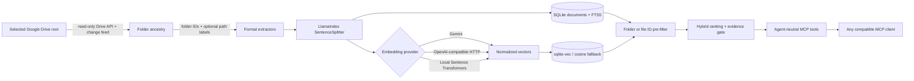

# Google Drive RAG MCP

[](https://github.com/phamviet86/google-drive-rag-mcp/actions/workflows/ci.yml)
[](LICENSE)

## Overview

Google Drive RAG MCP is a local-first hybrid retrieval service exposed to compatible MCP clients
over `stdio`. It uses LlamaIndex `SentenceSplitter` for chunking and a durable SQLite
FTS5/vector index; it does not use LlamaCloud. Choose an embedding provider and model that fit your
languages, privacy boundary, and infrastructure, then let every authorized local MCP client query
the same shared index.

This repository is one component of the Google Services MCP collection.

Google Drive/Workspace remains the read-only source of truth. The service stores extracted chunks,
normalized embeddings, metadata, checksums, sync state, and index data—not downloaded source files.
LlamaIndex remains isolated at the replaceable chunking boundary; storage, synchronization, and
retrieval stay local to this service.

> **Important:** retrieval assists research; it is not legal, tax, financial, economic, or business
> advice. Agents and people must inspect the linked source, effective date, jurisdiction, and later
> amendments. If `evidence.sufficient` is false, abstain instead of filling gaps.

The package is currently classified as Alpha in `pyproject.toml`.

[Contributing](CONTRIBUTING.md) · [Security policy](SECURITY.md) ·
[Code of Conduct](CODE_OF_CONDUCT.md)

### Architecture



## Features

- Recursively read one configured Drive folder or Shared Drive scope with the read-only API.
- Store every ancestor folder ID so any folder can be used as a recursive search boundary.
- Store relative Drive paths for readable citations without deriving client-specific scopes.
- Filter FTS5 and vector candidates by a caller-supplied Drive folder or file ID before ranking.
- Extract Google Docs, Google Sheets, text/Markdown, text-based PDFs, and DOCX.
- Support Gemini, verified OpenAI-compatible `/embeddings` endpoints, and optional local Sentence
  Transformers behind one embedding protocol.
- Combine Unicode-safe SQLite FTS5 keyword search with sqlite-vec cosine search, with a tested
  Python cosine fallback when the extension cannot load.
- Use the Drive Changes API after an initial full scan, remove deleted or out-of-scope files, and
  support periodic full reconciliation.
- Use native Google API retries and chunked media downloads, and refuse authoritative deletion when
  Drive reports an incomplete full-scan result.
- Prevent vectors from different providers, models, endpoints, or dimensions from sharing an index
  by recording and validating an embedding fingerprint.
- Return citations, source modified/indexed times, and a conservative evidence decision.
- Expose retrieval-only MCP tools over `stdio`, with no listening network port.

## MCP tools

All tool names and instructions are agent-neutral and marked read-only.

| Tool | Purpose |
| --- | --- |
| `search_knowledge(query, scope_id, limit=5)` | Search one indexed file ID, or one folder ID and all descendants, with citations and an evidence decision; `limit` is clamped to 1–20 |
| `get_document(file_id)` | Resolve an indexed Drive ID and instruct the caller to read the current source through Google Workspace |
| `get_document_metadata(file_id)` | Return URL, relative path, ancestor folder IDs, checksum, and modified/indexed times |
| `check_index_status()` | Return shared counts, indexed Drive root, last sync, vector backend, and embedding fingerprint |

Weak hits are placed in `candidate_results` for diagnostics; normal `results` remain empty when the
top score is below `GOOGLE_DRIVE_RAG_EVIDENCE_THRESHOLD`. Each hit includes its indexed `file_id`
for a current Google Workspace read.

Search returns indexed excerpts, not a second authoritative document. `get_document` deliberately
does not return reconstructed full cached text; use its Drive ID with Google Workspace when the
complete or current document is required.

## Requirements

- Python 3.11 or newer, matching `requires-python = ">=3.11"` in `pyproject.toml`. CI tests 3.11
  through 3.14; the examples below use Python 3.12 where an explicit interpreter is useful.
- A Google account and Google Cloud project with the Google Drive API enabled.
- An OAuth 2.0 Desktop App client.
- An embedding provider: Gemini, an OpenAI-compatible endpoint, or the optional local Sentence
  Transformers extra.
- A local MCP client that supports `stdio` servers.

Language coverage is a property of the selected model, not an indexing “language mode.” FTS5 uses
SQLite's Unicode tokenizer, while semantic quality depends on the model and domain. Evaluate your
actual languages and documents; this project does not claim perfect support for every language.

## Installation

Clone the repository and install the base package:

```bash
git clone https://github.com/phamviet86/google-drive-rag-mcp.git
cd google-drive-rag-mcp
python3.12 -m venv .venv
. .venv/bin/activate
pip install -e .
cp .env.example .env
```

For the local provider, install the optional extra instead:

```bash
pip install -e '.[sentence-transformers]'
```

The project does not automatically parse `.env`. Load it with your shell or process manager; for
example, in a trusted interactive shell:

```bash
set -a
. ./.env
set +a
```

Never commit `.env`. Chunking uses a built-in deterministic sentence tokenizer at the LlamaIndex
boundary, so normal operation does not require NLTK corpora or depend on how package files are
linked on disk.

## Google Cloud and OAuth setup

1. Open [Google Cloud Console](https://console.cloud.google.com/).
2. Create or select a project and enable the **Google Drive API**.
3. Configure the OAuth consent screen.
4. Create an OAuth client ID with application type **Desktop app**.
5. Download `client_secret.json` and keep it protected outside this repository.
6. Authenticate from a desktop that can open the browser flow:

```bash
google-drive-rag-mcp-auth --client-secret /secure/google/client_secret.json
```

The equivalent subcommand is
`google-drive-rag-mcp auth-google --client-secret /secure/google/client_secret.json`.

The project accepts only the Desktop client JSON shape with a top-level `installed` object. The
browser flow requests only `https://www.googleapis.com/auth/drive.readonly` and stores the refresh
token at `~/.config/google-drive-rag-mcp/token.json` with owner-only permissions. Token writes are
atomic, a refresh token is required, refreshed credentials are persisted with mode `0600`, and the
containing directory is created or tightened to mode `0700` on POSIX systems.
Set `GOOGLE_TOKEN_FILE` only to use a different protected path; `~` is expanded. Its parent is made
private, so use a dedicated token directory rather than a directory intentionally shared with other
users or services.

The Drive API has no OAuth scope meaning “read only this existing folder.” The token can read files
the user can read; the indexer enforces `GOOGLE_DRIVE_FOLDER_ID` during traversal. See Google's
[Drive authorization guide](https://developers.google.com/workspace/drive/api/guides/api-specific-auth).

## Environment variables

Copy `.env.example` as a starting point, then load it into every indexing process. The MCP server
needs the selected database, root folder ID, and embedding configuration; it needs embedding access
for query vectors but does not need Google credentials unless that same environment also runs sync.

### Drive and index settings

| Variable | Required | Default | Purpose |
| --- | --- | --- | --- |
| `GOOGLE_DRIVE_FOLDER_ID` | Yes for sync and serve | None | Root folder indexed by the worker; the server verifies that it matches the root recorded in the database |
| `GOOGLE_DRIVE_SHARED_DRIVE_ID` | Only for a Shared Drive corpus | None | Pass the Shared Drive ID to Drive file listing and change-feed calls; still set `GOOGLE_DRIVE_FOLDER_ID` to the root folder within that scope |
| `GOOGLE_DRIVE_RAG_DB_PATH` | No | `data/index.db` | Path to the shared SQLite index |
| `GOOGLE_TOKEN_FILE` | No | `~/.config/google-drive-rag-mcp/token.json` | Google Drive OAuth token path used by authentication and sync |
| `GOOGLE_DRIVE_API_NUM_RETRIES` | No | `5` | Native retry count passed to Google API requests and media-download chunks; valid range `0`-`10`, with `0` disabling retries |
| `GOOGLE_DRIVE_DOWNLOAD_CHUNK_SIZE` | No | `8388608` | In-memory Drive media download chunk size in bytes |

Set `GOOGLE_DRIVE_RAG_DB_PATH` only when the shared index must live somewhere other than
`data/index.db`. Use the same path and embedding configuration for `sync`, `status`, and the MCP
server. Both database and token paths expand a leading `~`.

### Embedding providers

| Provider | Execution and privacy | Extra install | Notes |
| --- | --- | --- | --- |
| `gemini` (default) | Hosted; chunks and queries go to Google's embedding API | None | Default model is designed for multilingual retrieval; evaluate it on your corpus |
| `openai-compatible` | Hosted or self-hosted; data goes to the configured base URL | None | Implements the documented `POST /embeddings` JSON contract; a key may be optional for a trusted local endpoint |
| `sentence-transformers` | Local process/device after model download | `pip install -e '.[sentence-transformers]'` | Heavy PyTorch and model dependencies remain outside the base install |

Changing the embedding provider, model, endpoint, or dimensions requires rebuilding that vector
index or selecting a different database. Changing MCP clients or agents does not require
reindexing.

Gemini defaults:

```bash
export GOOGLE_DRIVE_RAG_EMBED_PROVIDER=gemini
export GOOGLE_DRIVE_RAG_EMBED_MODEL=gemini-embedding-001
export GOOGLE_DRIVE_RAG_EMBED_DIMENSIONS=768
export GOOGLE_DRIVE_RAG_EMBED_API_KEY_ENV=GEMINI_API_KEY
export GEMINI_API_KEY=your_runtime_secret
```

OpenAI-compatible endpoint:

```bash
export GOOGLE_DRIVE_RAG_EMBED_PROVIDER=openai-compatible
export GOOGLE_DRIVE_RAG_EMBED_MODEL=text-embedding-3-small
export GOOGLE_DRIVE_RAG_EMBED_DIMENSIONS=1536
export GOOGLE_DRIVE_RAG_EMBED_BASE_URL=https://api.openai.com/v1
export GOOGLE_DRIVE_RAG_EMBED_API_KEY_ENV=OPENAI_API_KEY
export OPENAI_API_KEY=your_runtime_secret
```

`OPENAI_API_KEY` must be present when `GOOGLE_DRIVE_RAG_EMBED_API_KEY_ENV=OPENAI_API_KEY` and the
selected endpoint requires authentication. For another compatible endpoint, replace the base URL,
model, dimensions, key-variable name, and corresponding secret. Never put credentials in the base
URL. Set `GOOGLE_DRIVE_RAG_EMBED_SEND_DIMENSIONS=false` only when the verified endpoint/model does
not accept that optional field; the configured output dimension is still validated on every
response.

OpenRouter example using Qwen3 Embedding 8B at its full 4096 dimensions:

```bash
export GOOGLE_DRIVE_RAG_EMBED_PROVIDER=openai-compatible
export GOOGLE_DRIVE_RAG_EMBED_MODEL=qwen/qwen3-embedding-8b
export GOOGLE_DRIVE_RAG_EMBED_DIMENSIONS=4096
export GOOGLE_DRIVE_RAG_EMBED_BASE_URL=https://openrouter.ai/api/v1
export GOOGLE_DRIVE_RAG_EMBED_API_KEY_ENV=OPENROUTER_API_KEY
export OPENROUTER_API_KEY=your_runtime_secret
export GOOGLE_DRIVE_RAG_EMBED_QUERY_INPUT_TYPE=search_query
export GOOGLE_DRIVE_RAG_EMBED_DOCUMENT_INPUT_TYPE=search_document
```

Free OpenRouter endpoints may log or retain inputs. Do not send confidential Drive content to a
free endpoint unless its current data policy has been reviewed and explicitly accepted.

Local Sentence Transformers example:

```bash
pip install -e '.[sentence-transformers]'
export GOOGLE_DRIVE_RAG_EMBED_PROVIDER=sentence-transformers
export GOOGLE_DRIVE_RAG_EMBED_MODEL=sentence-transformers/paraphrase-multilingual-MiniLM-L12-v2
export GOOGLE_DRIVE_RAG_EMBED_DIMENSIONS=384
export GOOGLE_DRIVE_RAG_EMBED_DEVICE=cpu
```

The model name is an example, not a universal recommendation. Model download/cache behavior,
licenses, language coverage, memory use, and hardware requirements belong to the selected model.

The HTTP adapter follows the [official OpenAI embeddings request/response schema](https://platform.openai.com/docs/api-reference/embeddings/create).
Gemini uses the tasks and output dimensions described in the
[official Gemini embedding documentation](https://ai.google.dev/gemini-api/docs/embeddings). The
local adapter uses Sentence Transformers
[`encode_query` and `encode_document`](https://www.sbert.net/docs/package_reference/sentence_transformer/model.html)
with normalized output.

### Optional embedding and retrieval tuning

| Variable | Default | Purpose |
| --- | --- | --- |
| `GOOGLE_DRIVE_RAG_EMBED_BATCH_SIZE` | `32` | Embedding batch size |
| `GOOGLE_DRIVE_RAG_EMBED_TIMEOUT_SECONDS` | `60` | Hosted embedding request timeout |
| `GOOGLE_DRIVE_RAG_EMBED_SEND_DIMENSIONS` | `true` | Send the optional dimensions field to OpenAI-compatible endpoints |
| `GOOGLE_DRIVE_RAG_EMBED_QUERY_INPUT_TYPE` | Empty | Optional provider-specific query input type |
| `GOOGLE_DRIVE_RAG_EMBED_DOCUMENT_INPUT_TYPE` | Empty | Optional provider-specific document input type |
| `GOOGLE_DRIVE_RAG_EMBED_DEVICE` | Empty | Optional Sentence Transformers device |
| `GOOGLE_DRIVE_RAG_CHUNK_SIZE` | `700` | Chunk size used at the LlamaIndex boundary |
| `GOOGLE_DRIVE_RAG_CHUNK_OVERLAP` | `100` | Chunk overlap |
| `GOOGLE_DRIVE_RAG_EVIDENCE_THRESHOLD` | `0.35` | Minimum top score for sufficient evidence |

All providers return normalized vectors and must return exactly the configured dimensions.
Changing `GOOGLE_DRIVE_RAG_CHUNK_SIZE`, `GOOGLE_DRIVE_RAG_CHUNK_OVERLAP`, or
`GOOGLE_DRIVE_RAG_EMBED_DOCUMENT_INPUT_TYPE` does not automatically rewrite unchanged indexed
documents; run `google-drive-rag-mcp reindex --yes` to apply such a change across the corpus. Query
input type and evidence-threshold changes apply to subsequent searches, so pass those settings to
the MCP server environment.

## Running the server

Initialize and synchronize the shared index before serving it:

```bash
google-drive-rag-mcp init-db
google-drive-rag-mcp sync
google-drive-rag-mcp status
```

Then run the MCP server:

```bash
google-drive-rag-mcp
```

The command always uses `stdio` and does not open an HTTP port. `GOOGLE_DRIVE_FOLDER_ID` must be
available when serving because the server checks it against the root recorded by the last full
sync. Running `google-drive-rag-mcp serve` is equivalent to running the command without a
subcommand.

Index-maintenance commands:

| Command | Behavior |
| --- | --- |
| `google-drive-rag-mcp init-db` | Create or migrate the SQLite schema and validate its embedding identity; does not call Google Drive or an embedding API |
| `google-drive-rag-mcp sync [--full]` | Run an incremental sync, or force a complete tree reconciliation with `--full` |
| `google-drive-rag-mcp sync-loop [--interval-seconds 300] [--full-interval-seconds 86400]` | Poll changes continuously; the minimum intervals are 30 and 300 seconds |
| `google-drive-rag-mcp status` | Read index counts and freshness without external API calls |
| `google-drive-rag-mcp reindex --yes` | Delete generated index contents, bind the database to the configured embedding identity, and perform a full Drive sync |

`reindex` refuses to run without `--yes`. Both sync and reindex require the Drive root, a valid
OAuth token, and any embedding-provider credentials needed by the selected provider.

## MCP client configuration

Use absolute paths, pass `GOOGLE_DRIVE_FOLDER_ID` in every server configuration, and restart the
MCP client after changing its configuration.

### Codex

Add the server to `~/.codex/config.toml` or a trusted project `.codex/config.toml`:

```toml
[mcp_servers.google_drive_rag]
command = "/absolute/path/google-drive-rag-mcp/.venv/bin/google-drive-rag-mcp"
cwd = "/absolute/path/google-drive-rag-mcp"
env_vars = [
  "GOOGLE_DRIVE_FOLDER_ID",
  "GOOGLE_DRIVE_SHARED_DRIVE_ID",
  "GOOGLE_DRIVE_RAG_DB_PATH",
  "GOOGLE_DRIVE_RAG_EMBED_PROVIDER",
  "GOOGLE_DRIVE_RAG_EMBED_MODEL",
  "GOOGLE_DRIVE_RAG_EMBED_DIMENSIONS",
  "GOOGLE_DRIVE_RAG_EMBED_BASE_URL",
  "GOOGLE_DRIVE_RAG_EMBED_API_KEY_ENV",
  "GOOGLE_DRIVE_RAG_EMBED_BATCH_SIZE",
  "GOOGLE_DRIVE_RAG_EMBED_TIMEOUT_SECONDS",
  "GOOGLE_DRIVE_RAG_EMBED_SEND_DIMENSIONS",
  "GOOGLE_DRIVE_RAG_EMBED_QUERY_INPUT_TYPE",
  "GOOGLE_DRIVE_RAG_EMBED_DOCUMENT_INPUT_TYPE",
  "GOOGLE_DRIVE_RAG_EMBED_DEVICE",
  "GOOGLE_DRIVE_RAG_EVIDENCE_THRESHOLD",
  "GEMINI_API_KEY",
  "OPENAI_API_KEY",
  "OPENROUTER_API_KEY",
]
startup_timeout_sec = 30
tool_timeout_sec = 120
required = true
```

Only export optional variables and the secret required by the selected provider. For example,
OpenAI-compatible configuration needs `OPENAI_API_KEY` when
`GOOGLE_DRIVE_RAG_EMBED_API_KEY_ENV=OPENAI_API_KEY`; Gemini uses `GEMINI_API_KEY`, and the OpenRouter
example uses `OPENROUTER_API_KEY`.

See the [official Codex MCP guide](https://developers.openai.com/codex/mcp) for current client
configuration details.

### Hermes Agent

Hermes reads MCP servers from `~/.hermes/config.yaml` and supports environment substitution:

```yaml
mcp_servers:
  google_drive_rag:
    command: "/absolute/path/google-drive-rag-mcp/.venv/bin/google-drive-rag-mcp"
    args: []
    env:
      GOOGLE_DRIVE_FOLDER_ID: "${GOOGLE_DRIVE_FOLDER_ID}"
      GOOGLE_DRIVE_RAG_DB_PATH: "/absolute/path/google-drive-rag-mcp/data/index.db"
      GOOGLE_DRIVE_RAG_EMBED_PROVIDER: "${GOOGLE_DRIVE_RAG_EMBED_PROVIDER}"
      GOOGLE_DRIVE_RAG_EMBED_MODEL: "${GOOGLE_DRIVE_RAG_EMBED_MODEL}"
      GOOGLE_DRIVE_RAG_EMBED_DIMENSIONS: "${GOOGLE_DRIVE_RAG_EMBED_DIMENSIONS}"
      GOOGLE_DRIVE_RAG_EMBED_BASE_URL: "${GOOGLE_DRIVE_RAG_EMBED_BASE_URL}"
      GOOGLE_DRIVE_RAG_EMBED_API_KEY_ENV: "${GOOGLE_DRIVE_RAG_EMBED_API_KEY_ENV}"
      GEMINI_API_KEY: "${GEMINI_API_KEY}"
      OPENAI_API_KEY: "${OPENAI_API_KEY}"
      OPENROUTER_API_KEY: "${OPENROUTER_API_KEY}"
    timeout: 120
    connect_timeout: 30
    supports_parallel_tool_calls: true
```

Keep actual values in `~/.hermes/.env` or the parent environment. Remove unused API-key entries and
retain the one named by `GOOGLE_DRIVE_RAG_EMBED_API_KEY_ENV`. Add
`GOOGLE_DRIVE_SHARED_DRIVE_ID` to the environment that runs sync when indexing a Shared Drive.
Use an absolute `GOOGLE_DRIVE_RAG_DB_PATH` in Hermes because the server's working directory is not
set by this configuration. Forward any non-default embedding or retrieval-tuning variables used by
your deployment as additional `env` entries.
See the [official Hermes MCP guide](https://github.com/NousResearch/hermes-agent/blob/main/website/docs/user-guide/features/mcp.md).

### Generic MCP clients

Configure a standards-compliant client with command `google-drive-rag-mcp`, no arguments, a working
directory where `data/index.db` resolves correctly or an explicit absolute
`GOOGLE_DRIVE_RAG_DB_PATH`, the required
`GOOGLE_DRIVE_FOLDER_ID`, and the selected embedding environment. Client syntax varies; use its
native MCP adapter rather than copying an unverified client-specific shape.

## Usage and examples

### Drive folder scopes

`GOOGLE_DRIVE_FOLDER_ID` defines the tree indexed by the worker. Every supported file below that
root is indexed regardless of depth. The index records the root ID and every descendant folder ID
in each file's ancestry, so one `scope_id` accepts either a Drive folder ID or an indexed file ID:

- A top-level folder ID searches its entire indexed tree.
- A nested folder ID searches that folder and all descendants.
- A file ID searches only that indexed file.
- IDs outside the indexed tree return no search results.

Folder names remain visible through relative paths. There is no per-client index, scope
configuration, access policy, or database. The server refuses to start if
`GOOGLE_DRIVE_FOLDER_ID` differs from the root recorded by the last full sync.

### Sync and index maintenance

The first `sync` performs a full tree reconciliation and records a Drive start-page token. Later
runs consume the Drive Changes API and avoid re-embedding unchanged files. Complete reconciliation
removes deleted, inaccessible, or moved-out files; a folder change triggers that path because it can
change the ancestry of every descendant.

Drive API requests use the SDK's native randomized exponential-backoff retries. File
content is downloaded or exported with `MediaIoBaseDownload` after Drive reports
`capabilities.canDownload=true`. A remaining permission, quota, rate-limit, or backend error aborts
the sync instead of being interpreted as deletion. Incremental sync deletes immediately only for a
Drive `change.removed` event or a `404/notFound` lookup; other unsupported, trashed, or out-of-scope
change results are left for a complete reconciliation. If any full-scan page reports
`incompleteSearch=true`, the scan aborts before its partial result can drive authoritative cleanup.
The default retry count is `5`, rather than the shorter metadata-oriented default used by the Tasks
service, because Drive sync also performs long-running paginated scans and chunked media transfers.
The upper bound of `10` prevents an accidental configuration from making failures retry indefinitely.
Every sync iteration closes its Google API transport in a `finally` block, including failed scans.

Run a durable polling worker:

```bash
google-drive-rag-mcp sync-loop --interval-seconds 300 --full-interval-seconds 86400
```

Force a complete reconciliation when needed:

```bash
google-drive-rag-mcp sync --full
```

### Database migration and embedding identity

Each database records provider, model, dimensions, endpoint identity, and a SHA-256 fingerprint.
The MCP status tool returns provider/model/dimensions/fingerprint but does not expose the endpoint.

Version 0.1.x databases did not record embedding identity. A non-empty legacy index cannot be
safely inferred, so version 0.2 refuses to open it. Back up the database if desired, load the same
Drive and embedding credentials, then explicitly rebuild:

```bash
google-drive-rag-mcp reindex --yes
```

This deletes only generated index data in the selected database and performs a full Drive sync; it
does not modify Drive. An empty legacy database is stamped automatically.

- Version 0.3 added path-classification columns to existing databases; version 0.5 no longer uses
  those legacy columns.
- Version 0.4 replaced label-based authorization with recursive folder-ID ancestry. The schema
  migrates automatically, but old rows need `google-drive-rag-mcp sync --full` before serving.
- Version 0.5 made the service and index shared across clients and removed per-profile access
  configuration. Existing populated 0.4 ancestry data remains compatible.

### Khởi động nhanh bằng tiếng Việt

Đây là ví dụ cộng đồng; dự án không mặc định một ngôn ngữ. Chất lượng tìm kiếm ngữ nghĩa phụ thuộc
vào model embedding đã chọn.

1. Bật Google Drive API, tạo OAuth Desktop client và chạy
   `google-drive-rag-mcp-auth --client-secret /path/to/client_secret.json`.
2. Sao chép `.env.example` thành `.env`, cấu hình thư mục Drive, embedding và secret, rồi nạp các
   biến vào môi trường.
3. Chạy `google-drive-rag-mcp sync` để tạo index.
4. Chạy `google-drive-rag-mcp` qua `stdio` từ MCP client với cùng folder, database và embedding.
5. Khi `evidence.sufficient=false`, từ chối kết luận và luôn mở nguồn Drive để kiểm tra ngày hiệu
   lực cùng trích dẫn.

## Troubleshooting

- **Server says `GOOGLE_DRIVE_FOLDER_ID` is required:** export the same root folder ID used to build
  the selected database and include it in the MCP client environment.
- **Configured root does not match the index:** select the intended database path or run
  `google-drive-rag-mcp sync --full` with the intended root.
- **Embedding identity mismatch:** restore the provider/model/dimensions/endpoint used for that
  database, select a different database path, or deliberately run `reindex --yes`.
- **Server opens an empty or unexpected index:** relative database paths are resolved from the MCP
  subprocess working directory. Set an absolute `GOOGLE_DRIVE_RAG_DB_PATH` in the client config.
- **Embedding request is unauthorized:** export the secret named by
  `GOOGLE_DRIVE_RAG_EMBED_API_KEY_ENV` into both the sync process and MCP server environment. An
  OpenAI-compatible local endpoint may omit the secret only when it accepts unauthenticated calls.
- **Changes are not visible:** run `sync`; use `sync --full` for folder moves, ancestry changes, or
  manual reconciliation.
- **Drive quota or backend error:** the SDK retries according to `GOOGLE_DRIVE_API_NUM_RETRIES` and
  then exits non-zero rather than deleting indexed data. Operational failures are emitted as one
  JSON object per line on stderr.
- **Full sync reports `incompleteSearch`:** narrow the Drive corpus/configuration and retry. The
  partial listing is deliberately not used to delete indexed documents.
- **File cannot be downloaded:** confirm Drive reports `capabilities.canDownload=true` for the OAuth
  user; download restrictions abort the sync rather than silently removing cached index entries.
- **Scanned PDF has no content:** this project does not perform OCR; apply OCR before indexing.
- **Low or insufficient evidence:** choose and evaluate an appropriate multilingual/domain model,
  then tune `GOOGLE_DRIVE_RAG_EVIDENCE_THRESHOLD` with representative queries.

Known limitations:

- Sheets index displayed cell values and sheet names, not charts, comments, or formula logic.
- Docs comments, suggestions, revision history, linked files, and rich layout are not preserved.
- Slides, images, audio, video, shortcuts, and arbitrary binary formats are skipped.
- The change feed is polling rather than a push webhook; freshness is bounded by the worker
  interval, and folder changes intentionally trigger a full reconciliation.
- FTS tokenization is Unicode-aware but not a language-specific morphological analyzer.
- Search scores are heuristics, not probabilities.
- SQLite suits a small shared service, not high-write or large distributed workloads.

## Security

- Keep `.env`, databases, OAuth tokens, client secrets, downloaded files, model caches, and
  generated indexes outside source control.
- SQLite contains extracted source text. Encrypt disks and backups and restrict OS/volume access.
- Hosted embedding providers receive extracted chunks during sync and queries during search.
  Review their data terms and residency; use an appropriate local model when data must not leave
  the host.
- API-key values come only from environment variables. Base URLs containing credentials are
  rejected. The embedding fingerprint never stores an API key, and MCP status omits the endpoint.
- Rotate Google and embedding credentials and restart affected processes after rotation.
- Any local client that can start the configured server can query every folder or file contained in
  its index root. The shared index does not replicate native per-file Drive ACLs or isolate client
  profiles; keep only documents intended for all tool users under `GOOGLE_DRIVE_FOLDER_ID`.
- MCP tools are retrieval-only; Drive writes and index mutation are not exposed through MCP.
- See [SECURITY.md](SECURITY.md) for reporting and deployment hardening.

## Development and contributing

Install the locked development environment with
[uv](https://docs.astral.sh/uv/) and run all configured checks:

```bash
uv sync --locked --extra dev
uv run ruff format --check .
uv run ruff check .
uv run mypy src/google_drive_rag_mcp
uv run pytest
uv run google-drive-rag-mcp --help
uv run google-drive-rag-mcp auth-google --help
uv run google-drive-rag-mcp-auth --help
```

Tests use fake sources, HTTP transports, and deterministic Unicode-safe embeddings. They require
no Google, Gemini, OpenAI, or local-model credentials. See
[CONTRIBUTING.md](CONTRIBUTING.md) for contribution guidance.

Use the structured GitHub issue forms for sanitized bug reports and feature proposals. Report
suspected vulnerabilities through the private process in [SECURITY.md](SECURITY.md), and follow
[CODE_OF_CONDUCT.md](CODE_OF_CONDUCT.md) in all project spaces. Never post credentials or private
Drive content in an issue, pull request, test, screenshot, or log.

## License

[MIT](LICENSE)

## References

- [Google Drive authorization guide](https://developers.google.com/workspace/drive/api/guides/api-specific-auth)
- [Google Drive download and export guide](https://developers.google.com/workspace/drive/api/guides/manage-downloads)
- [Google Drive error handling](https://developers.google.com/workspace/drive/api/guides/handle-errors)
- [Google Drive `files.list` response](https://developers.google.com/workspace/drive/api/reference/rest/v3/files/list)
- [LlamaIndex `SentenceSplitter`](https://docs.llamaindex.ai/en/stable/api_reference/node_parsers/sentence_splitter/)
- [OpenAI embeddings API](https://platform.openai.com/docs/api-reference/embeddings/create)
- [Gemini embeddings](https://ai.google.dev/gemini-api/docs/embeddings)
- [Sentence Transformers API](https://www.sbert.net/docs/package_reference/sentence_transformer/model.html)
- [MCP Python SDK](https://github.com/modelcontextprotocol/python-sdk)
