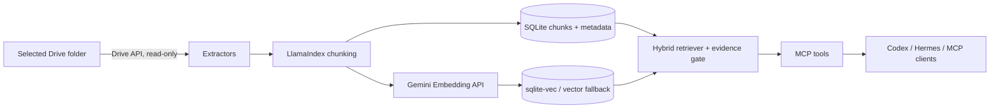

# gdrive-rag-mcp

[](https://github.com/phamviet86/gdrive-rag-mcp/actions/workflows/ci.yml)
[](LICENSE)

A local-first, agent-neutral MCP server that indexes one Google Drive folder (including nested
folders) and provides multilingual hybrid retrieval. It is designed for Vietnamese and English
knowledge bases and requires no LlamaCloud or OpenAI API.

> **Important:** retrieval assists research; it is not legal, tax, financial, economic, or business
> advice. Agents and people must inspect the linked source, effective date, jurisdiction, and later
> amendments. If `evidence.sufficient` is false, abstain instead of filling gaps.

## What the MVP does

- Reads Google Drive with the read-only Drive scope, limited by configuration to one folder or a
  folder in a Shared Drive.
- Extracts Google Docs, Google Sheets, text/Markdown, text-based PDFs, and DOCX.
- Uses LlamaIndex's `SentenceSplitter` as a replaceable pipeline component.
- Creates Vietnamese-capable `gemini-embedding-001` embeddings (768 dimensions by default).
- Stores only extracted chunks, embeddings, metadata, checksums, sync state, and index data in
  SQLite. Source files remain in Drive.
- Combines SQLite FTS5 keyword ranking with sqlite-vec cosine search. A tested Python cosine
  fallback is used if the extension cannot load.
- Reindexes changed files and removes deleted or out-of-scope files on later syncs.
- Exposes the same read-only MCP tools over local stdio and bearer-protected Streamable HTTP.

## Architecture



Google and Gemini credentials stay with the service operator. Remote clients receive only an MCP
URL and bearer token; tools never return credentials.

## Prerequisites

- Python 3.11 or 3.12
- A Google Cloud project with the **Google Drive API** enabled
- A Gemini API key with access to `gemini-embedding-001`
- Either a service-account JSON file or an OAuth Desktop client JSON file

The stable Gemini model supports flexible output sizes and recommends 768 among its supported
dimensions; see the [official Gemini model documentation](https://ai.google.dev/gemini-api/docs/models/gemini-embedding-001).

## Install and configure

```bash
git clone https://github.com/phamviet86/gdrive-rag-mcp.git
cd gdrive-rag-mcp
python3.12 -m venv .venv
. .venv/bin/activate
pip install -e .
cp .env.example .env
```

This project does not automatically parse `.env`; load it with your shell or process manager. For
example, `set -a; . ./.env; set +a` in a trusted interactive shell. Never commit `.env`.

### Google authentication: service account (recommended for least privilege)

1. Create a service account in your Google Cloud project and download its JSON key to an
   operator-only secrets directory.
2. Share only the selected Drive folder with the service account's email as **Viewer**. This is the
   strongest folder boundary for this MVP: an otherwise unprivileged service account can see only
   what was explicitly shared with it.
3. Set `GOOGLE_SERVICE_ACCOUNT_FILE` and `GDRIVE_FOLDER_ID`. For Shared Drives, add the service
   account as a member with the minimum read role and set `GDRIVE_SHARED_DRIVE_ID`.

Do not enable domain-wide delegation unless your organization has separately reviewed and needs
it. The code requests only `https://www.googleapis.com/auth/drive.readonly`.

### Google authentication: user OAuth

1. Create an OAuth **Desktop app** client and put its JSON file outside the repository.
2. Set `GOOGLE_OAUTH_CLIENT_FILE` and `GOOGLE_OAUTH_TOKEN_FILE`.
3. Run `gdrive-rag-mcp auth-google` once and approve read-only access.

The Drive API has no OAuth scope that means “read only this existing folder.” The OAuth token can
read files the user can read; the indexer enforces the configured folder during traversal. Prefer a
folder-shared service account when credential-level isolation matters. Scope details are in
[Google's Drive authorization guide](https://developers.google.com/workspace/drive/api/guides/api-specific-auth).

### Build and refresh the index

```bash
gdrive-rag-mcp init-db
gdrive-rag-mcp sync
gdrive-rag-mcp status
```

Run `sync` periodically with cron, systemd, a container scheduler, or your platform scheduler. A
sync records `completed_at`; `check_index_status` exposes it. The MVP scans the configured tree on
each run, avoids rechunking/re-embedding unchanged checksums, reindexes a changed whole file, and
deletes stale records.

## MCP tools

All tools are marked read-only in MCP metadata.

| Tool | Purpose |
|---|---|
| `search_knowledge(query, limit)` | Hybrid search, citations, freshness, and evidence decision |
| `get_document(document_id)` | Full indexed text assembled from ordered chunks |
| `get_document_metadata(document_id)` | URL, MIME type, checksum, modified/indexed times |
| `check_index_status()` | Counts, last sync, and active vector backend |

`search_knowledge` returns normal `results` only when the top score reaches
`GDRIVE_RAG_EVIDENCE_THRESHOLD`. Weak candidates are separated into `candidate_results` for
diagnostics, with an explicit instruction to abstain.

## Local mode (stdio)

```bash
gdrive-rag-mcp serve --transport stdio
```

The client launches this command. The operator must make the database and required environment
variables available to that subprocess. MCP clients do not send Google or Gemini credentials over
MCP.

### Hermes Agent local YAML

Add to `~/.hermes/config.yaml`; keep actual values in `~/.hermes/.env` or the parent environment.

```yaml
mcp_servers:
  gdrive_knowledge:
    command: "/path/to/gdrive-rag-mcp/.venv/bin/gdrive-rag-mcp"
    args: ["serve", "--transport", "stdio"]
    env:
      GDRIVE_RAG_DB_PATH: "${GDRIVE_RAG_DB_PATH}"
      GEMINI_API_KEY: "${GEMINI_API_KEY}"
    timeout: 120
    connect_timeout: 30
    supports_parallel_tool_calls: true
```

Search requires Gemini for the query embedding. A separately scheduled sync process holds Google
credentials; the stdio query server does not need them.

### Codex local TOML

Add to `~/.codex/config.toml` (or trusted project `.codex/config.toml`):

```toml
[mcp_servers.gdrive_knowledge]
command = "/path/to/gdrive-rag-mcp/.venv/bin/gdrive-rag-mcp"
args = ["serve", "--transport", "stdio"]
cwd = "/path/to/gdrive-rag-mcp"
env_vars = ["GDRIVE_RAG_DB_PATH", "GEMINI_API_KEY"]
startup_timeout_sec = 30
tool_timeout_sec = 120
required = true
```

Codex supports stdio environment forwarding and Streamable HTTP bearer tokens as documented in
the [official Codex MCP guide](https://developers.openai.com/codex/mcp).

## Server mode (Streamable HTTP)

Generate a token with at least 32 random characters and store it in a secret manager:

```bash
export GDRIVE_RAG_BEARER_TOKEN="$(openssl rand -hex 32)"
gdrive-rag-mcp serve --transport http
```

The MCP endpoint is `http://127.0.0.1:8000/mcp`; `GET /health` is an unauthenticated liveness
check with no index details. Every `/mcp` request requires `Authorization: Bearer ...`.

For network deployment, terminate TLS at a trusted reverse proxy/load balancer, pass the
`Authorization` header unchanged, restrict inbound networks where possible, and bind the app only
to the proxy network. Never expose plain HTTP or put a bearer token in a URL, image, or repository.

### Docker Compose

The provided Compose file assumes service-account authentication:

```bash
mkdir -p secrets
# Place service-account.json in secrets/; this directory is ignored.
export GDRIVE_RAG_BEARER_TOKEN="$(openssl rand -hex 32)"
export GEMINI_API_KEY="your-runtime-secret"
export GDRIVE_FOLDER_ID="your-folder-id"
docker compose run --rm app sync
docker compose up -d app
```

The named `index-data` volume persists SQLite data. The image contains no credentials or index.

### Hermes Agent remote YAML

```yaml
mcp_servers:
  gdrive_knowledge:
    url: "https://knowledge.example.com/mcp"
    headers:
      Authorization: "Bearer ${GDRIVE_RAG_BEARER_TOKEN}"
    timeout: 120
    connect_timeout: 30
    supports_parallel_tool_calls: true
```

### Codex remote TOML

```toml
[mcp_servers.gdrive_knowledge]
url = "https://knowledge.example.com/mcp"
bearer_token_env_var = "GDRIVE_RAG_BEARER_TOKEN"
startup_timeout_sec = 30
tool_timeout_sec = 120
required = true
```

## Security and data handling

- The repository ignores `.env`, databases, OAuth tokens, client secrets, service-account keys,
  downloaded data, and generated indexes.
- SQLite contains extracted source text. Protect its file/volume as confidential data, encrypt
  disks/backups, and restrict OS access.
- Rotate bearer tokens and Google/Gemini credentials. Restart the service after rotation.
- Tools are retrieval-only; Drive writes and index mutation are not exposed through MCP.
- Bearer auth is intentionally simple. For enterprise deployments, a secure reverse proxy may add
  identity-aware access, mTLS, rate limiting, audit logs, and short-lived tokens.
- See [SECURITY.md](SECURITY.md) for private vulnerability reporting and deployment hardening.

## Honest limitations

- Scanned/image-only PDFs need OCR before indexing; this project does not perform OCR.
- Sheets index displayed cell values and sheet names, not charts, drawings, comments, hidden-state
  semantics, or formula logic. Very large sheets may be expensive to export.
- Docs comments, suggestions, revision history, linked files, and rich layout are not preserved.
- Google Slides, images, audio, video, shortcuts, and arbitrary binary formats are skipped.
- Sync is a folder-tree scan rather than the Drive Changes API. Changes appear only after the next
  successful sync. A failed sync does not update the recorded completion time.
- Search scores are heuristics, not probabilities. Tune the evidence threshold with domain-specific
  evaluation before relying on it in high-stakes research.
- SQLite is appropriate for a small shared service, not high-write or large distributed workloads.
  Storage/retrieval adapters are deliberately isolated for later replacement.

## Development

```bash
python3.12 -m venv .venv
. .venv/bin/activate
pip install -e '.[dev]'
ruff format --check .
ruff check .
mypy src/gdrive_rag_mcp
pytest
```

Tests use deterministic fake embeddings and fake sources; they require no Google or Gemini
credentials. See [CONTRIBUTING.md](CONTRIBUTING.md).

## Khởi động nhanh bằng tiếng Việt

1. Tạo service account, bật Google Drive API, rồi chia sẻ **chỉ thư mục cần lập chỉ mục** với quyền
   Viewer.
2. Sao chép `.env.example` thành `.env`, điền `GDRIVE_FOLDER_ID`, `GEMINI_API_KEY` và đường dẫn tệp
   service account ở ngoài repository.
3. Nạp biến môi trường, chạy `gdrive-rag-mcp sync`, sau đó chạy
   `gdrive-rag-mcp serve --transport stdio` hoặc server HTTP có bearer token.
4. Cấu hình Hermes/Codex theo mẫu phía trên. Khi `evidence.sufficient=false`, agent phải từ chối kết
   luận; luôn mở nguồn Google Drive, kiểm tra ngày hiệu lực và trích dẫn.

## License

[MIT](LICENSE)
